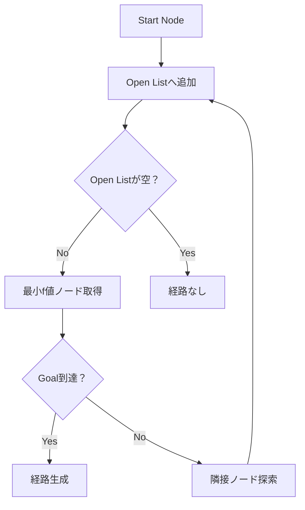

# A* Pathfinding Visualizer (C++)

グリッド上で A* アルゴリズムの経路探索を可視化するツールです。  
障害物の配置・スタート/ゴール設定を行い、最短経路をリアルタイムに確認できます。

アルゴリズム理解とゲームAI基礎の学習目的で制作しました。
## Demo

## Controls
| 操作 | 内容 |
|---|---|
| 左クリック | 障害物配置（ドラッグ可） |
| 右クリック | Start / Goal 設置 |
| Spaceキー | 障害物リセット |

## Algorithm

A* アルゴリズムを使用し、4方向グリッド上で最短経路探索を行います。

評価関数：
f(n) = g(n) + h(n)

- g(n)：開始ノードからの移動コスト
- h(n)：マンハッタン距離ヒューリスティック

## Pathfinding Flow

## Build

SDL2 が必要です。

Windows（MinGW例）:
g++ main.cpp -lSDL2 -o AStarDemo
