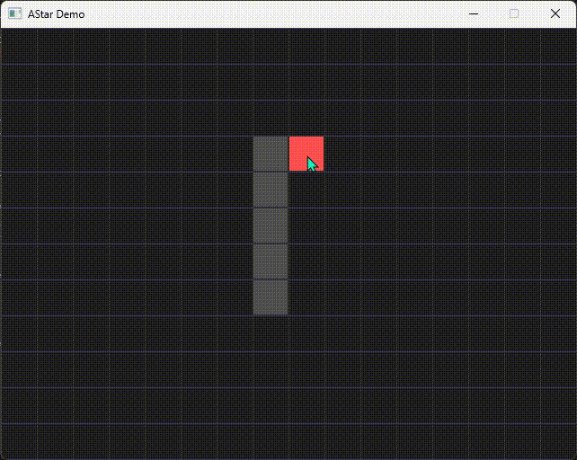

# Game Programmer Portfolio
### 新田 喜大
Gameplay Programmer (C++ / C#)

ゲームプレイプログラマーを志望しています。  
C++ と C# を使用し、アルゴリズム実装と Unityゲーム開発を行っています。  
「遊びの体験を支えるゲームシステム実装」が得意分野です。

## Projects

### 2D シューティングゲーム（Unity / C#）

3分で遊べるスコアアタック型シューティングゲームです。  
敵のWave制御・弾幕・スコアシステムを実装しています。

- 🎬 プレイ動画
字幕あり

字幕なし

- 💾 [実行ファイル Windows用(exe)](https://drive.google.com/file/d/1mrhnKYKGXsr1C1LA5TOWXOKeZmfwhMnD/view?usp=sharing)
- 📂 [プロジェクト詳細](./WaveSurvival/README.md)

### A* 経路探索 可視化ツール（C++ / SDL）

A*アルゴリズムの動作をGUIで可視化するツールです。  
障害物配置・スタート/ゴール設定・経路表示が可能です。

- 📂 [プロジェクト詳細](./AStarDemo/README.md)

## Skills
- C++
- C#

## Links
- 🎬 [Shooting Game Play Movie（YouTube）](https://youtu.be/JeHjaCccNoc)
- 💾 [Shooting Game Download（exe）](https://drive.google.com/file/d/1mrhnKYKGXsr1C1LA5TOWXOKeZmfwhMnD/view?usp=sharing)