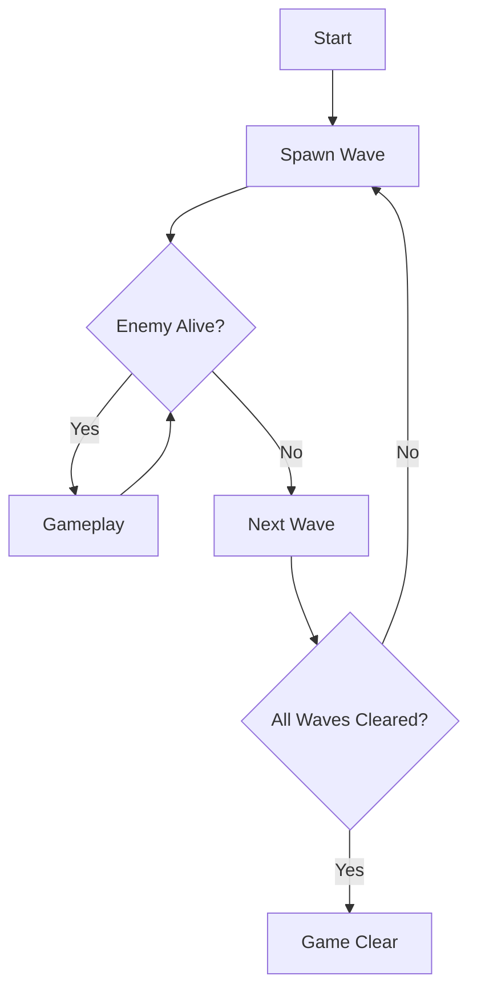

# 2D Shooting Game (Unity)

## Gameplay

ゲームプレイ動画  
  

## Overview
3分で遊べるスコアアタック型2Dシューティングゲームです。  
敵のWave出現・弾幕・スコアシステムなど、ゲームプレイの基礎システムを一から実装しました。

ゲームプレイ動画 字幕あり  
  

## Download
Windows 実行ファイルは下記から  
💾 [Shooting Game Download（exe）](https://drive.google.com/file/d/1mrhnKYKGXsr1C1LA5TOWXOKeZmfwhMnD/view?usp=sharing)  

## Development Info
| 項目 | 内容 |
|---|---|
| 開発期間 | 約1ヶ月 |
| エンジン | Unity |
| 言語 | C# |
| 人数 | 個人制作 |

## Game Features
- Wave制による敵出現システム
- 四方向多重スクロール背景
- スコアアタックシステム
- リザルト画面・ランク表示

## Implementation Highlights

### Enemy Wave Management
Waveごとに敵を生成・全滅時に次Waveへ遷移する管理システムを実装。

### Multi-directional Parallax Scrolling
四方向に対応した多重スクロール背景を実装。  
レイヤーごとにスクロール速度を変化させ、奥行きを表現。

### Scoring System
撃破・生存時間に応じたスコア加算を実装。

### Result Screen
スコアカウントアップ・ランク表示を実装。

## Game Flow

## Controls
| 操作 | 内容 |
|---|---|
| 移動 | WASD / 矢印キー |
| ショット | Space |

## Future Improvements
- ボス戦追加
- プレイヤー強化
- 敵撃破時の演出強化（連鎖時）

## Assets
Unity外部からの素材について記載します。
### オーディオ
 - 魔王魂 ([BGM](https://maou.audio/bgm_fantasy06/))
 - 効果音ラボ([SE](https://soundeffect-lab.info/sound/battle/))
### テクスチャ
UnityAsset [Vertical 2D Shooting Assets Pack](https://assetstore.unity.com/packages/2d/characters/vertical-2d-shooting-assets-pack-188719)
※一部テクスチャは、手書きです。（背景、カーソル）
